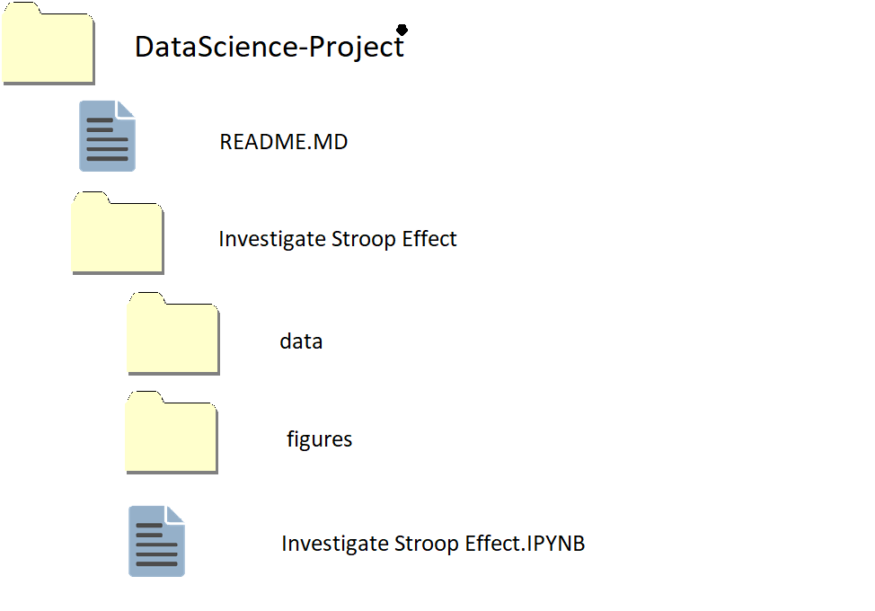

A repository of different data science project I have been working on. 
Each project is stored in folder named after its project name. The details of what the project is about are in the readme file for each folder. 
Each project folder contains sub folders such as data and figures. 
A jupyter notebook named after the project name will be present inside the project folder where we discuss the project details and findings. 
The Directory structure is as follows. 

